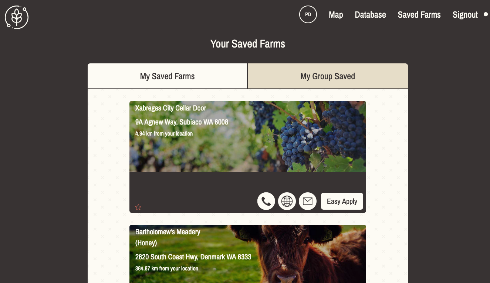

# Farmify - Vue.js, OpenStreetMaps with Vue2-Leaflet Implementation of Australian Farm Database

Full implementation using Vue.js 2 with map functionality powered with Open Street Maps, Database view, filter functionalities.

Also working combination of Google Firebase and Netlify Functions used here.

- All code is provided and free for use, learning and further development.

## Front Page

- The front page

## Map

- Australien map, built with Open Street Maps. Clickable icons loaded from Database via Google Firebase.

## Database

- Database view. Loads automatically from database entries. Also different filter options and pagination provided.

## Saved Farms/Database Entries

- Saved database entry from the map and database view can be viewed. Saved entries get stored by using cookies.

##Used Packages:

- Vue.js
- Netlify
- Vuex
- Vue Router
- Vue2-Leaflet
- Tailwindcss
- Axios